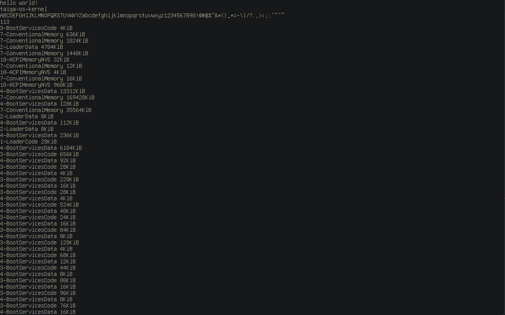

#  Taiga OS - a simple operating system
<p align="center">


</p>

```
    /\    Taiga os
    /\    description: this is a simple operating system writen completely 
   /__\   in rust from scratch with no external libraries
   / .\   target: x86_64
  /____\  uefi boot: true
  /  . \         _
 /  .   \     |\'/-..--.
/________\   / _ _   ,  ;
   |  |     `~=`Y'~_<._./
   |  |	     <`-....__.'
```

## features 🐈
* [x] custom x86_64 UEFI bootloader
* [x] simple console output in the kernel
* [x] very simple memory paging
 * [ ] a simple shell
    * [ ] simple PS2 driver ⌨️
    * [ ] simple lexer
    * [ ] some system calls and functions
* [ ] run a form of  doom💥

## how to build
* rust compiler
* qemu

1. install rust targets   `rustup target add x86_64-unknown-uefi` and
    `rustup target add x86_64-unknown-none`
2. build the the operating system `./batch/build` and `d`
3. run `./batch/run`

## current progress


## bugs
* efi status is u32  and not usize even though it needs to be usize, because it(being a usize) brakes the load file function and it won't work for some reason 
* memory map index is smaller then it is supposed to be